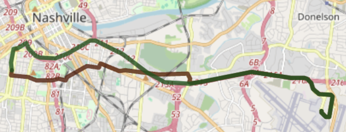

# Time Accurate Routing with Valhalla

This repository contains scripts and Docker files to build and run a time-accurate routing engine using the Valhalla routing engine enhanced with predicted traffic data.

This repo is intedend to enable Valhalla to recognize travel time differences and route accordingly given predicted traffic information and a date time input.
```
time: 2024-09-21T07:00, travel time:  557.625  , travel length:  14.862
time: 2024-09-22T08:00, travel time:  5110.337 , travel length:  14.05
```
<p align="center">
    
</p>

## Getting Started

1. **Clone the Repository:**
   ```shell
   git clone https://github.com/smarttransit-ai/time-accurate-routing.git
   cd time-accurate-routing
   ```

2. **Set Up a Virtual Environment:**
   ```shell
   python3 -m venv venv
   venv/bin/python -m pip install -r requirements.txt
   ```

3. **Build the Docker Image:**
   ```shell
   sudo docker build -t valhalla .
   ```

4. **Run the Docker Container:**
   ```shell
   sudo docker run -dt --name valhalla -p 8002:8002 valhalla
   ```

5. **Generate and Add Predicted Traffic:**
   - Open and run the `create_historical_traffic.ipynb` notebook to generate traffic data and add it to the routing graph.

## Note
- Ensure that the Docker container is running before executing the notebook or any scripts involved.

## Files
Below is a description of each file included in this repository.
<details>
<summary>Show/Hide Details</summary>  

### 1. Valhalla DockerFile
- **Description:** This DockerFile is used to build a Docker image for the Valhalla routing engine. The image is built from the official Valhalla docker image 3.5.0 and adds dependencies and tools to run the routing engine with predicted traffic.
- **Usage:**
  ```shell
  sudo docker build -t valhalla .
  sudo docker run -dt --name valhalla -p 8002:8002 valhalla
  ```
- **Modifiers:** Within the DockerFile `tennessee-latest.osm.pbf` is downloaded and referenced, modify those references to fit your needs. [Geofabrik](https://download.geofabrik.de/) has alternatives.

### 2. create_historical_traffic.ipynb
- **Description:** This Jupyter Notebook generates and copies the traffic data to the Docker container, and adds the predicted traffic to the routing graph.
- **Modifiers:** Modify `SPEED DATA` cell to fit your needs
- **Note:** This notebook should be run after the Docker container is built and running.


### 3. valhalla_add_predicted_traffic.sh
- **Description:** This script copies the traffic data to the Docker container and adds the predicted traffic to the routing graph.
- **Usage:**
  ```shell
  bash valhalla_add_predicted_traffic.sh
  ```

- *This script is called from `create_historical_traffic.ipynb`.*

### 4. valhalla_encode_speed.cc
- **Description:** This C++ program uses the `valhalla::baldr` functions to compress and encode a vector of historical speeds.
- **Input:** Historical speeds of the format:
  ```
  "10, 10, ... 100, 100, 100"
  ```
- **Output:** Encoded speeds of the format:
  ```
  "AAAAAA...AAAAAA"
  ```
- **Usage:**
  ```shell
  ./valhalla_encode_speed <historical_speeds>
  ```
- **Compile:**
  ```shell
  g++ -o valhalla_encode_speed valhalla_encode_speed.cc -I/usr/local/include -L/usr/local/lib -lvalhalla
  ```
- **Dependencies:** Valhalla

- *This program is compiled in DockerFile and called in `create_historical_traffic.ipynb`.*

### 5. valhalla_ways_to_ids.cc
- **Description:** This C++ program uses Valhalla functions to generate the ways_edges export and converts it into a CSV file with the features `osm_id`, `edge_id`, `graph_id`, and `path`.
- **Input:** N/A
- **Output:**
  ```
  valhalla_tiles/way_edges_ids_paths.csv
  ```
- **Usage:**
  ```shell
  ./valhalla_ways_to_ids
  ```
- **Compile:**
  ```shell
  g++ -o valhalla_ways_to_ids valhalla_ways_to_ids.cc -I/usr/local/include -I/usr/local/include/valhalla/third_party -L/usr/local/lib -lvalhalla -lz -lcurl
  ```
- **Dependencies:** Valhalla, libboost-all-dev, protobuf-compiler, libcurl4-openssl-dev

- *This program is compiled and called in DockerFile, and optionally called in `create_historical_traffic.ipynb`.*
</details>  

## Contact
For further questions, please contact [smarttransit-ai](https://github.com/smarttransit-ai).